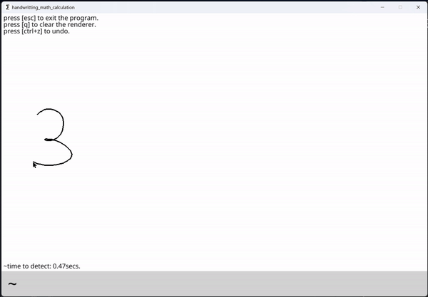

# handwritting_math_calculation

This projetc is Handwritten Math Solver



## About us
This project combines a graphical interface with an Artificial Intelligence model to recognize and compute handwritten mathematical expressions.

### Main features
- graphical user interface (Pygame).
- Detection of symbol on the interface (Opencv)
- AI model trained to recognize numbers (0-9) and mathematical operators (+, -, *, /).
- Instant resolution of handwritten mathematical expressions.

### Technologies used
- **Python**: main language.
- **Pygame**: graphical user interface.
- **TensorFlow/Keras**: for the handwriting recognition AI model.


## Installation

### Étapes

**1. prerequisites :**
   
- Python 3.12+


**2. Clone the repo :**
   ```bash
   git clone https://github.com/SIFFRINP/handwritting_math_calculation.git
   ```

**3. To install all the necessary libraries, you will need to use:**

```sh
pip install -r requirements.txt
```

**4. Execution :**
   
```sh  
python main.py
```

**5. Command :** 

- Undo: CTRL+Z
- Clean the interface: q
- Close the program: ESC