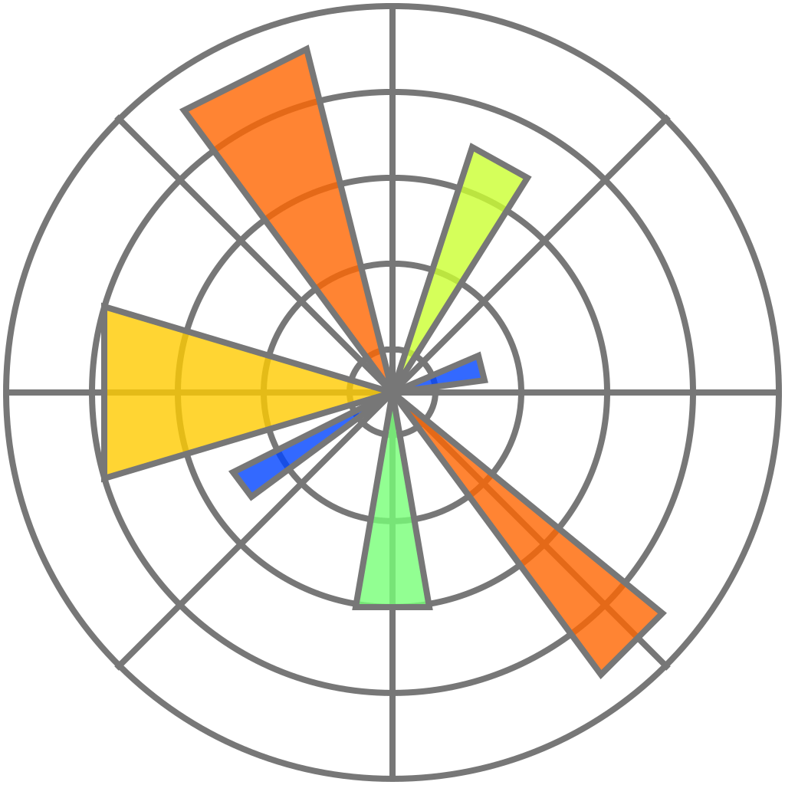

# handwritting_math_calculation

This project is a handwritten math solver. It is capable of solving basic calculus composed of addition, substraction, multiplication and division. 

<p align="center">
    
    
    <br />
    <i align="center">Examples of the program running.</i>
</p>

## About the project
This project combines a graphical interface with an Artificial Intelligence model to recognize and compute handwritten mathematical expressions.

To train our handwritten recognition model, we used <a href="https://www.kaggle.com/datasets/xainano/handwrittenmathsymbols">this dataset</a> published on Kaggle by <a href="https://www.kaggle.com/xainano">Xai Nano</a>. 

#### Main features
- Graphical user interface written using pygame.
- Detection and isolation of symbols on the interface using opencv.
- AI model trained to recognize numbers between 0 and 9 and mathematical operators (+, -, *, /).
- In real time resolution of handwritten mathematical expressions.

#### Technologies used
<div align="center">
  
  
  
  
  
  
  
  
  
  
  
  
</div>


## Installation
Before trying to use our program, make sure that you have <b><a href="https://www.python.org/downloads/release/python-3127/">python 3.12+</a></b> installed on your machine. Note that <b>python 3.13</b> is not compatible with our program since tensorflow has not been ported to this version yet. 

#### Clone the repo
Use those commands to download the project and to move into the project folder named `handwritting_math_calculation`. 
```bash
git clone https://github.com/SIFFRINP/handwritting_math_calculation.git
cd handwritting_math_calculation
```

#### Install requirements 
Our program use three main libraries which are `pygame`, `tensorflow` and `opencv`. To install them run this command. 
```bash
pip install -r requirements.txt
```

#### Execution
Once every dependencies are installed, you can run the program using this command. 
```bash
python main.py
```

## Tweaks
You can tweak the behaviour of the program by changing values in the `configuration.py`. For example, you can change the level of debugging information by changing the `DEBUG` variable.
```python
# DEBUG LEVELS: 
# - 0: No debug info.
# - 1: Only print statements. 
# - 2: Images processing debug. 
DEBUG = 0
```

## Licence
- SIFFRINP & romainflcht